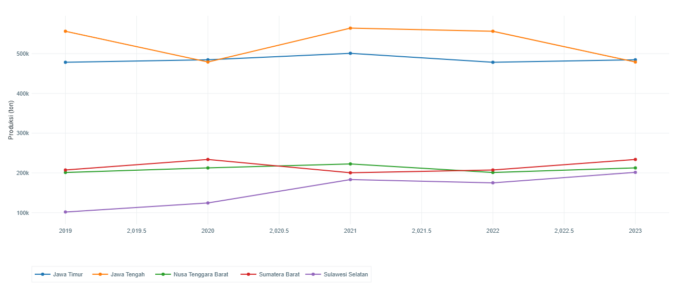

# Visualisasi Data Produksi Sayuran per Provinsi di Indonesia

## Project Based Learning Grafika Komputer dan Visualisasi

Proyek akhir mata kuliah **Grafika Komputer dan Visualisasi (KOM1304)** TA 2024/2025 oleh **Kelompok 3 Paralel 3**.  
Topik visualisasi yang diangkat adalah **Produksi Tanaman Sayuran per Provinsi di Indonesia** berdasarkan data dari Badan Pusat Statistik (BPS).

---

## 📽️ Video + Source Code

Video rekaman presentasi beserta source codenya dapat di akses melalui link berikut :  

[ipb.link/visualisasi-data-produksi-sayuran](https://ipb.link/visualisasi-data-produksi-sayuran)

*Notes: video ini memiliki kesalahan penyebutan asal paralel, seharusnnya kami berasal dari paralel 3.

## 🌐 Website Proyek

Website hasil dari proyek ini dapat diakses melalui tautan berikut:
[visualisasi-produksi-sayuran.netlify.app/](https://visualisasi-produksi-sayuran.netlify.app/)

---
## 👥 Anggota Kelompok

| Nama                        | NIM         |
| --------------------------- | ----------- |
| Afif Fakhri Muhammad        | G6401231007 |
| Husni Abdillah              | G6401231097 |
| Daffa Naufal Mumtaz Heryadi | G6401231168 |

---

## 📊 Deskripsi Proyek

Proyek ini bertujuan untuk memvisualisasikan data produksi sekitar 24 jenis sayuran yang dihasilkan oleh provinsi-provinsi di Indonesia selama beberapa tahun terakhir.

Visualisasi dibuat agar mudah dipahami dan dapat digunakan untuk melihat tren, perbandingan antar wilayah, serta kontribusi terhadap produksi nasional.

---

## 🔍 Visualisasi Data

Proyek ini menyediakan tiga jenis laman visualisasi data untuk membantu analisis produksi sayuran berdasarkan data per provinsi di Indonesia:

### 📈 Line Chart

Menampilkan tren produksi salah satu komoditas sayuran di berbagai provinsi selama 5 tahun terakhir.

- Mempermudah analisis pertumbuhan atau penurunan produksi antar provinsi.
- Membantu melihat perbedaan pola antar wilayah.

### 📊 Bar Chart

Distribusi produksi beberapa jenis sayuran di berbagai provinsi pada tahun tertentu.

- Menggambarkan provinsi sentra produksi utama.
- Mengungkap disparitas atau ketimpangan produksi.

### 🥧 Pie Chart

Proporsi jenis sayuran terhadap total produksi nasional pada satu tahun tertentu.

- Memvisualisasikan dominasi komoditas.
- Membandingkan dengan komposisi produksi per provinsi.

---
## 🖼️ Tampilan Laman Website

Berikut adalah contoh tangkapan layar dari masing-masing laman:

### 📈 Halaman Line Chart

  

### 📊 Halaman Bar Chart

  

### 🥧 Halaman Pie Chart

  

## 📂 Sumber Data

Badan Pusat Statistik. (2024). _Produksi Tanaman Sayuran_.  
Diakses dari: [https://www.bps.go.id/id/statistics-table/2/NjEjMg==/produksi-tanaman-sayuran.html](https://www.bps.go.id/id/statistics-table/2/NjEjMg==/produksi-tanaman-sayuran.html)

---

## ‼️ Kesimpulan

Dengan memanfaatkan library Javascript Plotly, visualisasi data Produksi Sayur di Indonesia dapat dibuat dan informasi kompleks dari data Badan Pusat Statistik dapat disajikan ke dalam bentuk visual yang informatif dan mudah dipahami. Melalui kombinasi _line chart, bar chart,_ dan _pie chart,_ visualisasi yang dihasilkan mampu menunjukkan tren produksi secara jelas antar waktu dan wilayah, menyediakan perbandingan visual antar provinsi dan jenis komoditas, dan juga menyajikan hasil analisis distribusi dan proporsi produksi dalam skala nasional maupun daerah.

Penggunaan Plotly juga memungkinkan penyajian data dalam bentuk grafik yang dinamis, responsif, dan mudah dieksplorasi oleh pengguna. Kelebihan Plotly seperti fitur _hover, zoom,_ dan _filtering_ membuat interaksi pengguna terhadap data menjadi lebih intuitif dan menarik. Visualisasi ini tidak hanya memperjelas pola yang tersembunyi dalam data, tetapi juga meningkatkan pengalaman pengguna dalam memahami informasi yang kompleks. Secara keseluruhan, proyek ini menunjukkan bahwa integrasi data statistik dengan visualisasi interaktif berbasis Plotly dapat menjadi alat bantu yang sangat efektif dalam menyampaikan insight dan mendukung pengambilan keputusan berbasis data.
